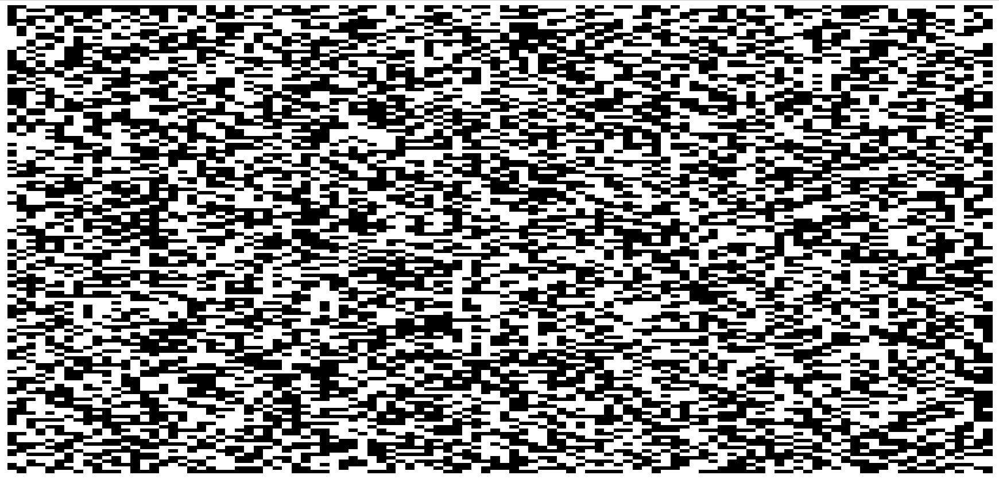
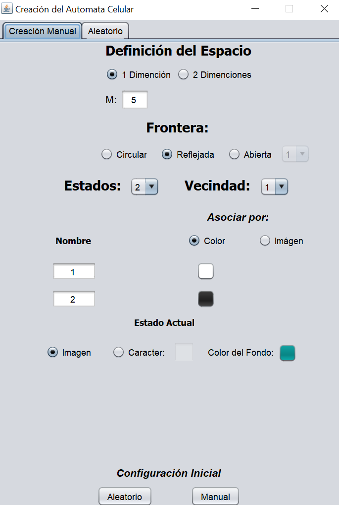
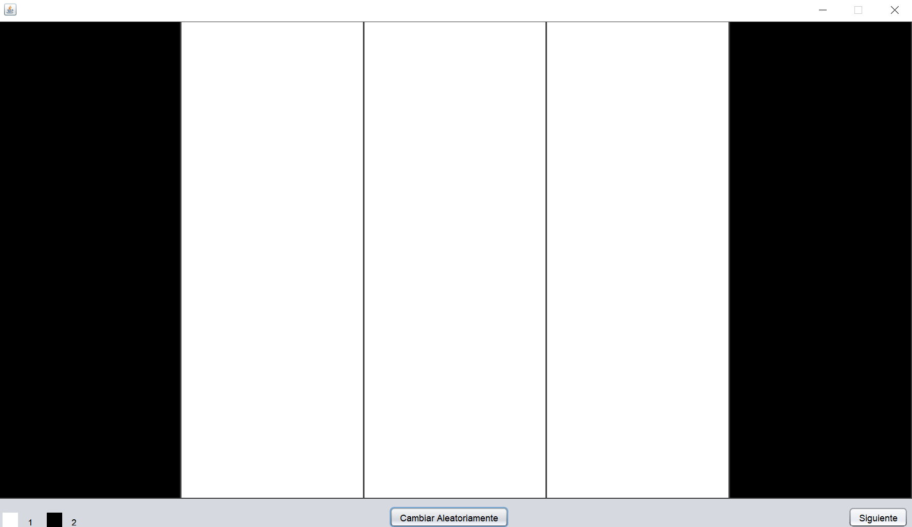

# Proyecto: Autómatas Celulares

### Reglas predefinidas
- Juego de la vida
- Hormiga de Langton
- Mayoría
- Suma
- Transito
- Cifrar/Descifrar imagen
- Cifrar/Descifrar mensaje

### UI

### Ejemplos

### Referencias
- [Wikipedia](https://es.wikipedia.org/wiki/Aut%C3%B3mata_celular)
